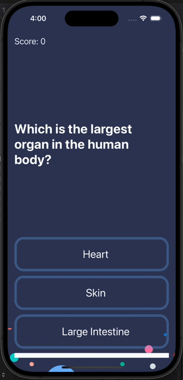

#  Quizzler



## Goal

Quizzler is a captivating quiz application developed using Swift and following the Model-View-Controller (MVC) architectural pattern. It presents users with multiple-choice questions, each with three options. The app dynamically updates the core content and status bar to reflect the number of questions remaining. Key features of the app include:

Multiple-Choice Questions: Quizzler generates quizzes with multiple-choice questions, providing users with a variety of options to choose from for each question.

## MVC Framework
The app's architecture follows the MVC framework, which separates the application's components into Model, View, and Controller:

### Model 
Contains the data and business logic. This includes the quiz questions, options, correct answers, and any additional quiz-related information.

### View
Presents the user interface elements, such as buttons, labels, and progress indicators. It displays the quiz questions and options to users.

### Controller
Acts as the intermediary between the model and the view. It manages user interactions, updates the UI based on user input, and handles business logic.

## Dynamic Content Updates 
Quizzler dynamically updates the core content to display the current question and options. As users progress through the quiz, the app adjusts the content to reflect the next question and available options.

## Status Bar Representation 
The app utilizes the status bar to indicate the number of questions remaining in the quiz. This provides users with a visual cue of their progress and helps them track their advancement through the quiz.

## Multiple Choice Quiz

```
 Question(q: "Which is the largest organ in the human body?", a: ["Heart", "Skin", "Large Intestine"], correctAnswer: "Skin"),
        Question(q: "Five dollars is worth how many nickels?", a: ["25", "50", "100"], correctAnswer: "100"),
        Question(q: "What do the letters in the GMT time zone stand for?", a: ["Global Meridian Time", "Greenwich Mean Time", "General Median Time"], correctAnswer: "Greenwich Mean Time"),
        Question(q: "What is the French word for 'hat'?", a: ["Chapeau", "Écharpe", "Bonnet"], correctAnswer: "Chapeau"),
        Question(q: "In past times, what would a gentleman keep in his fob pocket?", a: ["Notebook", "Handkerchief", "Watch"], correctAnswer: "Watch"),
        Question(q: "How would one say goodbye in Spanish?", a: ["Au Revoir", "Adiós", "Salir"], correctAnswer: "Adiós"),
        Question(q: "Which of these colours is NOT featured in the logo for Google?", a: ["Green", "Orange", "Blue"], correctAnswer: "Orange"),
        Question(q: "What alcoholic drink is made from molasses?", a: ["Rum", "Whisky", "Gin"], correctAnswer: "Rum"),
        Question(q: "What type of animal was Harambe?", a: ["Panda", "Gorilla", "Crocodile"], correctAnswer: "Gorilla"),
        Question(q: "Where is Tasmania located?", a: ["Indonesia", "Australia", "Scotland"], correctAnswer: "Australia")
```        

